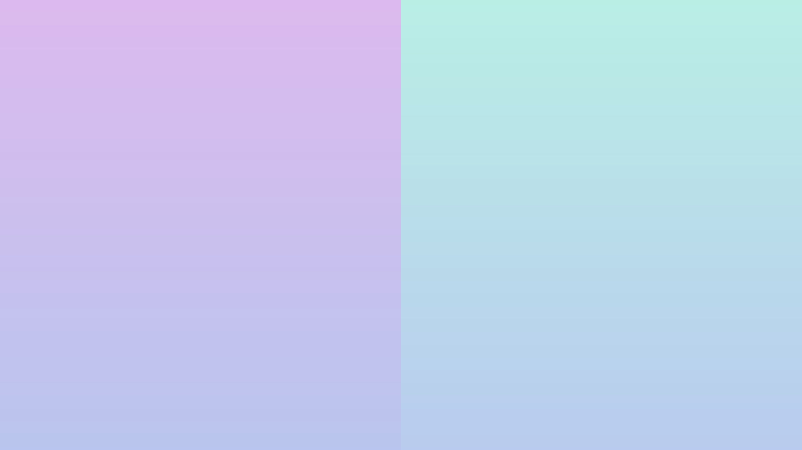
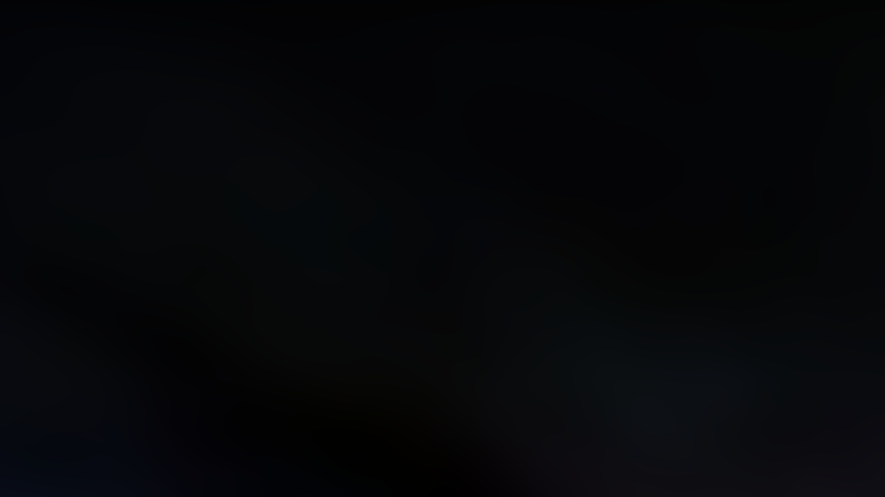
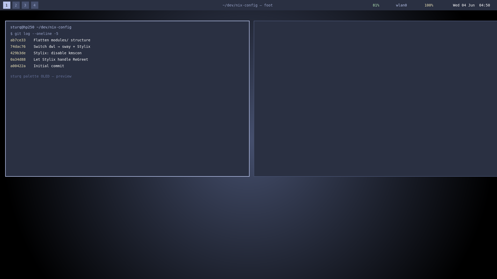

<div align="center">

# sturq-palette

OLED-optimized dark color palette. Near-black surfaces, pastel accents,
designed to look correct on both an AMOLED phone screen and a desktop
monitor without changing tone.


</div>

---

## Use it

The same palette in every format you'll realistically need:

| File | Format | Use case |
|---|---|---|
| [`formats/base16.yaml`](./formats/base16.yaml) | Base16 | Stylix, tinted-theming, base16 generators |
| [`formats/palette.json`](./formats/palette.json) | JSON | Web apps, JS bundlers, anything generic |
| [`formats/palette.toml`](./formats/palette.toml) | TOML | Rust / config files / generic |
| [`formats/variables.css`](./formats/variables.css) | CSS vars | Web UI, Zebar bars, any HTML target |

Pull a single file:

```sh
curl -O https://raw.githubusercontent.com/sturq/sturq-palette/main/formats/base16.yaml
```

Reference it directly from a Nix flake — see [`examples/`](./examples) below.

---

## Demos

### Surfaces — dark, deep, OLED-friendly


`crust → mantle → base → surface0 → surface1 → surface2` — six steps from
true black up to a slate that still reads as "dark" on a sunny window.

### Accents — pastel, low-contrast, easy on the eyes


All 14 accents share the same lightness, so syntax highlighting never has
one color "shouting" louder than the rest.

### Wallpapers — generated from the palette

|  |  |
|---|---|
| `base → mantle` linear gradient | radial glow from `surface1` |
|  |  |
| `mauve / lavender / teal / blue` split | plasma multiplied over `base` |

### Code sample — syntax highlighting in the palette


Mapped via the base16 scheme: keywords → `mauve`, functions → `lavender`,
strings → `green`, comments → `overlay0`, errors → `red`, types → `yellow`.

### Desktop mockup — bar + tiled windows



Top bar uses `base` background + `lavender` for active workspace; tiled
windows show `lavender` border (focused) vs `surface1` (unfocused). Same
look I run on the actual hp250 NixOS box with Sway + Stylix.

---

## Hex reference

### Core

| Token | Hex | Sample |
|---|---|---|
| base | `#2A3042` |  |
| primary | `#B9C5EE` |  |

### Surfaces

| Token | Hex |
|---|---|
| crust | `#000000` |
| mantle | `#060709` |
| base | `#2A3042` |
| surface0 | `#384058` |
| surface1 | `#46506E` |
| surface2 | `#586384` |

### Text & overlays

| Token | Hex |
|---|---|
| text | `#FFFFFF` |
| subtext1 | `#D8DCE9` |
| subtext0 | `#C2CAE5` |
| overlay2 | `#9CA7CE` |
| overlay1 | `#808CB7` |
| overlay0 | `#67739D` |

### Accents

| Token | Hex | Token | Hex |
|---|---|---|---|
| rosewater | `#EECBB9` | peach | `#EECFB9` |
| flamingo | `#EEC2B9` | yellow | `#EEE5B9` |
| pink | `#EEB9D3` | green | `#B9EEB9` |
| mauve | `#DCB9EE` | teal | `#B9EEE5` |
| red | `#EEB9BD` | sky | `#B9E1EE` |
| maroon | `#EEC0B9` | sapphire | `#B9D3EE` |
| | | blue | `#B9CBEE` |
| | | lavender | `#B9C5EE` |

### Base16 mapping

| Slot | Token | Hex |
|---|---|---|
| base00 | mantle | `#060709` |
| base01 | base | `#2A3042` |
| base02 | surface0 | `#384058` |
| base03 | surface1 | `#46506E` |
| base04 | overlay2 | `#9CA7CE` |
| base05 | text | `#FFFFFF` |
| base06 | subtext1 | `#D8DCE9` |
| base07 | subtext0 | `#C2CAE5` |
| base08 | red | `#EEB9BD` |
| base09 | peach | `#EECFB9` |
| base0A | yellow | `#EEE5B9` |
| base0B | green | `#B9EEB9` |
| base0C | teal | `#B9EEE5` |
| base0D | lavender | `#B9C5EE` |
| base0E | mauve | `#DCB9EE` |
| base0F | maroon | `#EEC0B9` |

---

## Used by

- [`sturq/nix-config`](https://github.com/sturq/nix-config) — NixOS via Stylix
- [`sturq/win-glazewm`](https://github.com/sturq/win-glazewm) — Windows via Zebar CSS variables

---

## License

CC0 1.0 — public domain. Use, remix, sell, ignore attribution.
