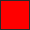
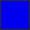

<div align="center">

# sturq-palette

Dark color palette with **Termux-default ANSI accents**. Pure black
surfaces, bright primary colours, designed so a terminal session and the
UI around it use the same exact hexes — Linux console, xterm, Termux,
they all start from `#cd0000` for red, `#0000ee` for blue, etc.


</div>

---

## Use it

The palette ships in every format that matters:

| File | Format | Typical use |
|---|---|---|
| [`formats/palette.json`](./formats/palette.json) | JSON | source of truth — parse from anywhere |
| [`formats/palette.toml`](./formats/palette.toml) | TOML | config files, Rust projects |
| [`formats/variables.css`](./formats/variables.css) | CSS vars | web UI, HTML status bars |
| [`formats/base16.yaml`](./formats/base16.yaml) | Base16 | tinted-theming generators |

Grab one file directly:

```sh
curl -O https://raw.githubusercontent.com/sturq/sturq-palette/main/formats/palette.json
```

The JSON tree is stable: `core`, `surfaces`, `text`, `accents` — with a
nested `bright` group under accents. Every other format is generated
from it, so they can never drift.

---

## Hex reference

### Core

|  | Token | Hex |
|---|---|---|
|  | base | `#2A3042` |
|  | primary | `#B9C5EE` |

### Surfaces

|  | Token | Hex |
|---|---|---|
|  | crust | `#000000` |
|  | mantle | `#000000` |
|  | dim | `#1C1C1C` |
|  | surface0 | `#2A3042` |
|  | surface1 | `#3A3A3A` |
|  | surface2 | `#586384` |

### Text & overlays

|  | Token | Hex |
|---|---|---|
|  | text | `#E5E5E5` |
|  | subtext1 | `#F5F5F5` |
|  | subtext0 | `#FFFFFF` |
|  | overlay2 | `#B2B2B2` |
|  | overlay1 | `#9CA7CE` |
|  | overlay0 | `#7F7F7F` |

### Accents — Termux default ANSI

|  | Token | Hex |  | Bright variant | Hex |
|---|---|---|---|---|---|
|  | red | `#CD0000` |  | bright_red | `#FF0000` |
|  | orange | `#CD5C00` |  | — | — |
|  | yellow | `#CDCD00` |  | bright_yellow | `#FFFF00` |
|  | green | `#00CD00` |  | bright_green | `#00FF00` |
|  | cyan | `#00CDCD` |  | bright_cyan | `#00FFFF` |
|  | blue | `#0000EE` |  | bright_blue | `#5C5CFF` |
|  | magenta | `#CD00CD` |  | bright_magenta | `#FF00FF` |
|  | maroon | `#800000` |  | — | — |

### Base16 mapping

|  | Slot | Token | Hex |
|---|---|---|---|
|  | base00 | mantle | `#000000` |
|  | base01 | dim | `#1C1C1C` |
|  | base02 | surface0 | `#2A3042` |
|  | base03 | surface1 | `#7F7F7F` |
|  | base04 | overlay2 | `#B2B2B2` |
|  | base05 | text | `#E5E5E5` |
|  | base06 | subtext1 | `#F5F5F5` |
|  | base07 | subtext0 | `#FFFFFF` |
|  | base08 | red | `#CD0000` |
|  | base09 | orange | `#CD5C00` |
|  | base0A | yellow | `#CDCD00` |
|  | base0B | green | `#00CD00` |
|  | base0C | cyan | `#00CDCD` |
|  | base0D | blue | `#0000EE` |
|  | base0E | magenta | `#CD00CD` |
|  | base0F | maroon | `#800000` |

---

## Repo layout

```
sturq-palette/
├── formats/
│   ├── palette.json   ← source of truth
│   ├── palette.toml
│   ├── variables.css
│   └── base16.yaml
├── assets/
│   ├── preview.png
│   └── swatches/<HEX>.png
├── scripts/
│   ├── build.sh        regenerates every format + asset
│   └── gen-preview.sh  rebuilds assets/preview.png alone
├── LICENSE
└── README.md
```

Only `formats/palette.json` is hand-edited. Everything else is rebuilt by
`scripts/build.sh` — run it after touching the JSON, commit the result.

## Used by

- [`sturq/nix-config`](https://github.com/sturq/nix-config) — NixOS via Stylix
- [`sturq/win-glazewm`](https://github.com/sturq/win-glazewm) — Windows via Zebar CSS variables + Windows accent color

---

## License

CC0 1.0 — public domain. Use, remix, sell, ignore attribution.
